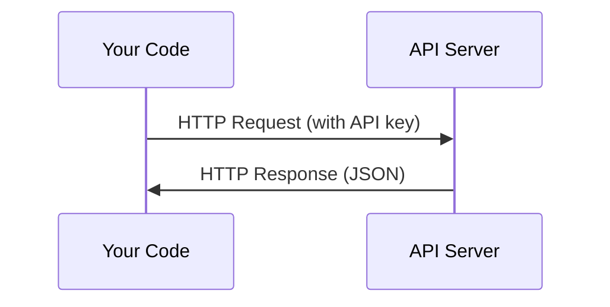

# APIs & Keys

> Every AI API works the same way: send a request, get a response. The details change, the pattern doesn't.

**Type:** Build
**Languages:** Python, TypeScript
**Prerequisites:** Phase 0, Lesson 01
**Time:** ~30 minutes

## Learning Objectives

- Store API keys securely using environment variables and `.env` files
- Make a Gemini API call using raw HTTP from Python and TypeScript
- Compare request/response handling across two languages for debugging
- Identify and handle common API errors including authentication and rate limits

## The Problem

Starting from Phase 11, you'll call LLM APIs (Anthropic, OpenAI, Google). In Phase 13-16 you'll build agents that use these APIs in loops. You need to know how API keys work, how to store them safely, and how to make your first API call.

## The Concept



Every API call has:
1. An endpoint (URL)
2. An API key (authentication)
3. A request body (what you want)
4. A response body (what you get back)

```figure
s0-secret-inject
```

## Build It

### Step 1: Store API keys safely

Never put API keys in code. Use environment variables.

```bash
export GEMINI_API_KEY="..."
```

Or use a `.env` file (add it to `.gitignore`):

```
GEMINI_API_KEY=...
```

In GitHub Actions, a repository secret is not automatically an environment variable. Map it in the job or step that runs this lesson:

```yaml
env:
    GEMINI_API_KEY: ${{ secrets.GEMINI_API_KEY }}
```

### Step 2: First API call (Python)

```python
import os
import urllib.request
import json

key = os.environ["GEMINI_API_KEY"]
model = os.environ.get("LLM_MODEL", "gemini-2.5-flash")
url = f"https://generativelanguage.googleapis.com/v1beta/models/{model}:generateContent"
body = json.dumps({"contents": [{"parts": [{"text": "What is a neural network in one sentence?"}]}]}).encode()
request = urllib.request.Request(url, data=body, headers={"Content-Type": "application/json", "x-goog-api-key": key}, method="POST")
with urllib.request.urlopen(request) as response:
    result = json.loads(response.read())
    print(result["candidates"][0]["content"]["parts"][0]["text"])
```

`LLM_MODEL` selects the Gemini model id, and the default `gemini-2.5-flash` is available on Gemini's free tier. The runnable file uses only Python's standard library.

### Step 3: First API call (TypeScript)

```typescript
const key = process.env.GEMINI_API_KEY;
const model = process.env.LLM_MODEL ?? "gemini-2.5-flash";
const url = `https://generativelanguage.googleapis.com/v1beta/models/${model}:generateContent`;
const response = await fetch(url, {
    method: "POST",
    headers: { "content-type": "application/json", "x-goog-api-key": key ?? "" },
    body: JSON.stringify({
        contents: [{ parts: [{ text: "What is a neural network in one sentence?" }] }],
    }),
});

console.log((await response.json()).candidates[0].content.parts[0].text);
```

### Step 4: Raw HTTP (no SDK)

```python
import json
import os
import urllib.request

key = os.environ["GEMINI_API_KEY"]
model = os.environ.get("LLM_MODEL", "gemini-2.5-flash")
url = f"https://generativelanguage.googleapis.com/v1beta/models/{model}:generateContent"
body = json.dumps({"contents": [{"parts": [{"text": "What is a neural network in one sentence?"}]}]}).encode()

req = urllib.request.Request(url, data=body, headers={"Content-Type": "application/json", "x-goog-api-key": key}, method="POST")
with urllib.request.urlopen(req) as resp:
    result = json.loads(resp.read())
    print(result["candidates"][0]["content"]["parts"][0]["text"])
```

This is what the SDKs do under the hood. Understanding the raw HTTP call helps when debugging.

## Use It

For this course:

| API | When you need it | Free tier |
|-----|-----------------|-----------|
| Google Gemini | This lesson and later model comparisons | `gemini-2.5-flash` has a free tier |
| Anthropic (Claude) | Phases 11-16 (agents, tools) | Credit-based |
| Hugging Face | Phases 4-10 (models, datasets) | Free |

You don't need all of them right now. Set them up when the lesson requires it.

## Ship It

This lesson produces:
- `outputs/prompt-api-troubleshooter.md` - diagnose common API errors

## Exercises

1. Create a Gemini API key and make your first API call
2. Run both language versions and compare their request and response handling
3. Intentionally use a wrong API key and read the error message

## Key Terms

| Term | What people say | What it actually means |
|------|----------------|----------------------|
| API key | "Password for the API" | A unique string that identifies your account and authorizes requests |
| Rate limit | "They're throttling me" | Maximum requests per minute/hour to prevent abuse and ensure fair usage |
| Token | "A word" (in API context) | A billing unit: input and output tokens are counted and charged separately |
| Streaming | "Real-time responses" | Getting the response word by word instead of waiting for the full response |
